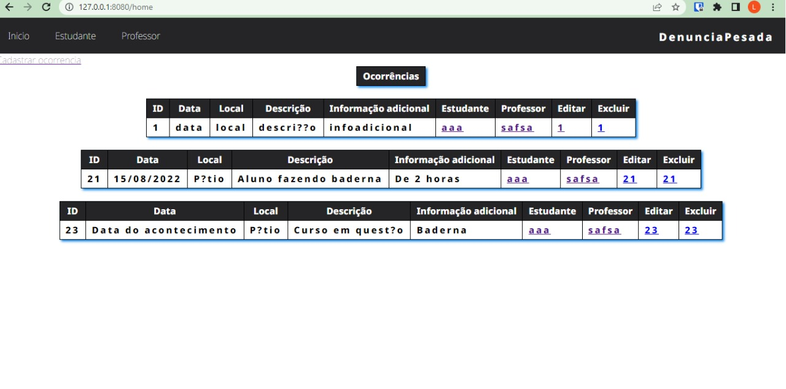
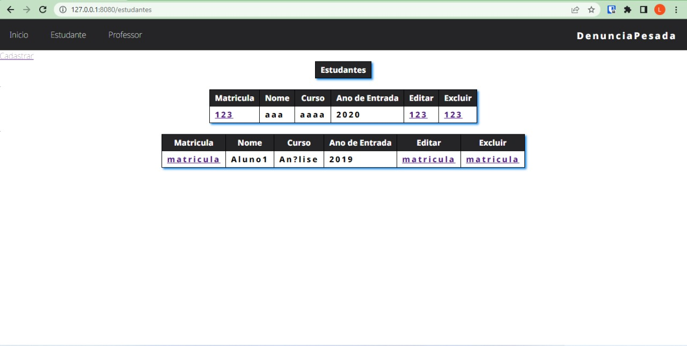
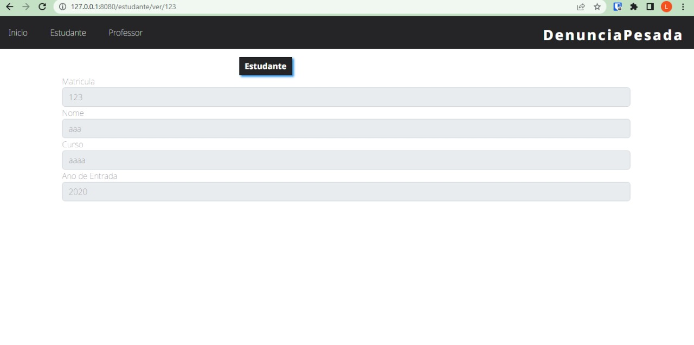
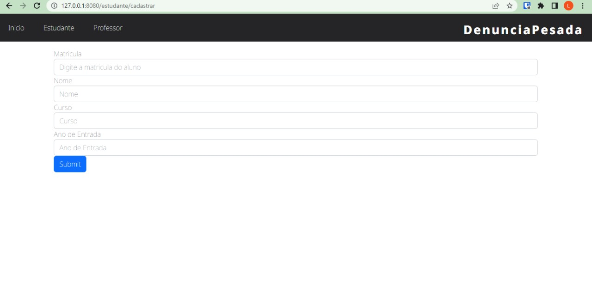
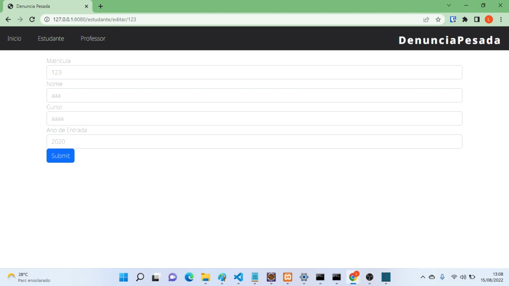

# Denuncia Pesada
## Hey, o Denuncia Pesada é um sistema web, desenvolvido com spring boot e JSP, para cadastrar ocorrencias feitas de alunos com professores. 

# Requisitos
- [x] CRUD de Professor
- [x] CRUD de Estudante
- [x] Registro de ocorrencia
- [x] Apresentação de todas as ocorrências cadastradas na página inicial
- [ ] Filtro de ocorrências por professor
- [ ] Filtro de ocorrências por estudante


# Demonstração


A demonstração da ferramenta será realizada através de um video que demonstrará o funcionamento da ferramenta que será mostrado através da perspectiva do usuário e seguirá os seguintes passos (a) CRUD ESTUDANTE, (b) CRUD PROFESSOR (c) CRUD OCORRÊNCIA.


```
https://drive.google.com/file/d/1jHSqicngIJakKknDJv3fljTBdoR_uUeh/view?usp=sharing
```


# Telas do sistema
Aqui vou deixar as principais telas do sistema para fácil visualização 

### Tela de Inicio
Aqui na tela de inicio podemos ver todas as ocorrências cadastradas



## Telas do CRUD padrão
Aqui veremos ver as telas do CRUD no foco da classe Estudante

### Tela para visualizar todos os objetos


### Tela para visualizar o objeto


### Tela para cadastrar um novo objeto


### Tela para editar o objetos



### Tela para deletar o objeto
Não tem nenhuma tela, depois que você clica em excluir o objeto ele é excluído logo em seguida :D


